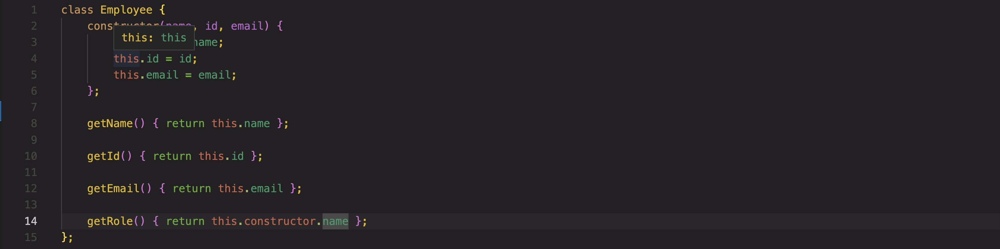
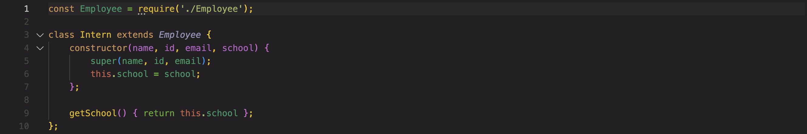
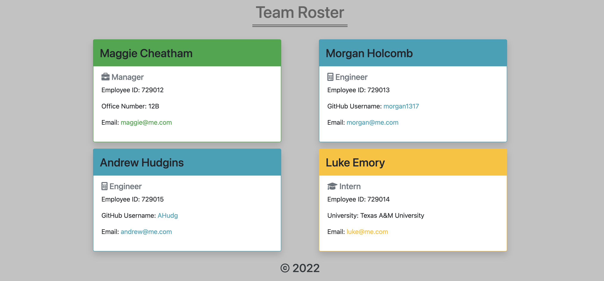

# ProfileBuilder-Team-Management
## Project Description
This project utilizes Object Oriented Programming (OOP) and Test Driven Development (TDD) to create a roster consisting of the manager, engineers, and interns. This project runs from the command line, accepting user input and populates a color coded roster index.html.

---
## Table of Contents
* [Installation Instructions](#installation)
* [Testing](#testing)
* [Usage](#usage)
* [Contact Information](#contact)

---

## -=Installation=-
Before running the program, install the *Inquirer* and *Jest* dependencies with:

npm i

 

## -=Testing=-
Within the root directory, run 

npm test

 within the command line to initate the tests that were written for the multiple javascript classes created through this codebase. There are five test suites with 14 total test.
 
 

## -=Usage=-
To run the code, type *node index.js* in the command line of the root directory. The command line will prompt you a series of questions necessary to create a functional README.me. Some inquiries are required and the code will not proceed without them. Once everyone is submitted to the roster, a *teamRoster.html* file is written to the /dist directory.

The use of Javascript classes allowed the creation of an overall Employee class that is then extended to the other classes containing object constructors for Manager, Employee, and Intern.

Displayed below is a sample html generated from the code and shown in the [walkthrough](https://drive.google.com/file/d/1ioCE3W2VjozG5bdyTv5wbJ2XCXc1g1h0/view) video. It color codes the employees by job position and includes the specific inquiries retrieved from the user. All links are clickable and the page is responsive utilizing Bootstrap.

## -=Contact=-
View the [walkthrough](https://drive.google.com/file/d/1ioCE3W2VjozG5bdyTv5wbJ2XCXc1g1h0/view) for this project and check out my other work on my [GitHub](https://github.com/AHudg).

Made by Andrew Hudgins :)